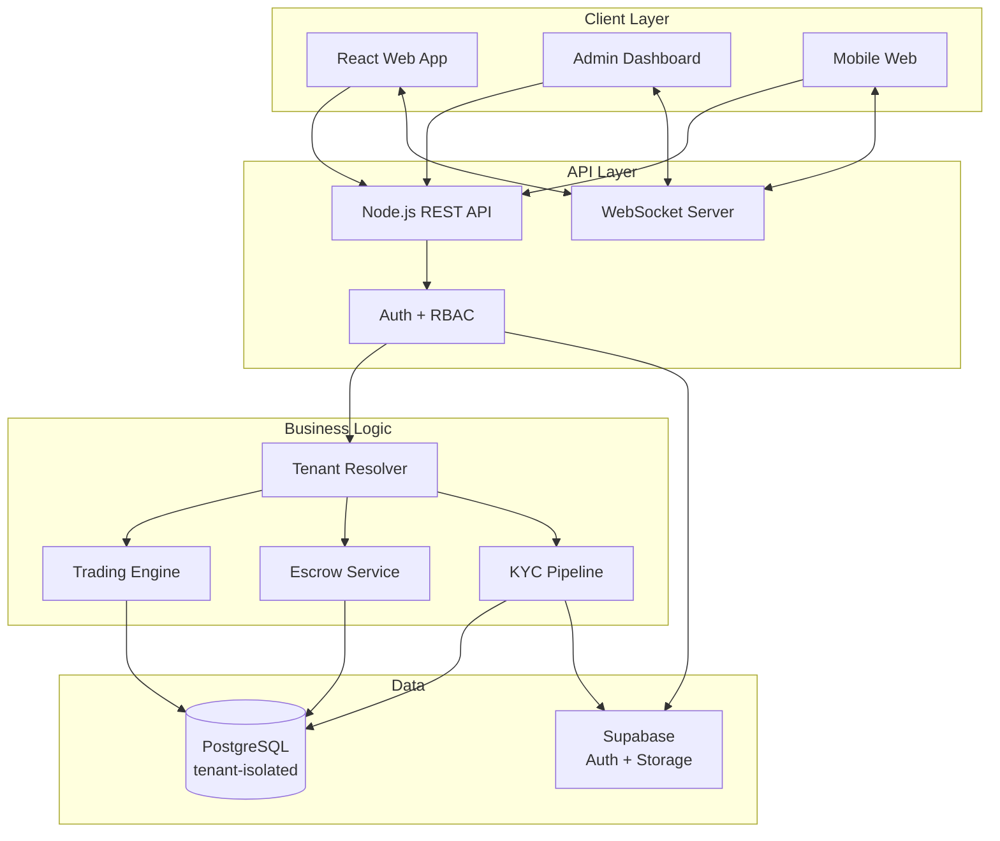

# 🏦 Exchange Platform v3

### Multi-Tenant Currency Exchange & P2P Trading Platform

*Real-time WebSocket trading • Role-based access • KYC + escrow • Built for scale*

[Features](#-features) • [Architecture](#-architecture) • [Tech Stack](#-tech-stack) • [Licensing](#-licensing--contact)

---

## 💡 Overview

**Exchange Platform v3** is a multi-tenant exchange infrastructure that lets organizations run their own branded currency-exchange and P2P trading desk. Each tenant gets isolated data, custom branding, configurable fees, and a full role hierarchy out of the box.

> Designed for currency exchange offices, crypto OTC desks, and B2B remittance operators that need white-label infrastructure without building from scratch.

---

## ✨ Features

### 🏢 Multi-Tenant Architecture
- Logical isolation per tenant (schema- or row-level)
- Per-tenant branding, fees, currencies, KYC requirements
- Tenant admin self-service portal

### 👥 Role-Based Access Control
- **Super Admin** — platform owner, manages tenants
- **Tenant Admin** — manages a single exchange organization
- **Manager** — operational supervisor
- **Staff** — counter operator
- **Customer** — end-user trading & wallet

### ⚡ Real-Time Trading Engine
- WebSocket-driven live order book & rate updates
- P2P marketplace for direct peer-to-peer trades
- Escrow service holding funds during dispute windows
- Optional auto-matching engine

### 🔐 Compliance & Security
- KYC document upload + verification workflow
- Audit log for every financial action
- Transaction limits per tier
- Two-factor authentication

---

## 🏛️ Architecture

---

## 🛠️ Tech Stack

| Layer | Technology |
|---|---|
| **Frontend** | React, TypeScript, Tailwind CSS |
| **Backend** | Node.js, Express, WebSocket |
| **Database** | PostgreSQL, Supabase |
| **Auth** | Supabase Auth + JWT |
| **Realtime** | WebSocket, Supabase Realtime |
| **Storage** | Supabase Storage (KYC docs) |

---

## 📸 Screenshots

> 🖼️ *Coming soon — trading desk, admin panel, KYC review screen.*

---

## 🔒 Security & Compliance

- End-to-end encryption for sensitive data
- Per-tenant data isolation
- Comprehensive audit trail
- Configurable transaction limits per user tier
- KYC workflow with document verification

---

## 📄 Licensing & Contact

This is **proprietary commercial software**. See [LICENSE](./LICENSE).

**Looking for:**
- 🏢 White-label deployment for your exchange business
- 🛠️ Custom feature development
- 🤝 Technology partnership

📧 **moslehmohammad2@gmail.com**
🐙 [github.com/Mosleh92](https://github.com/Mosleh92)

---

⭐ *Star this repo if you find it useful!*

